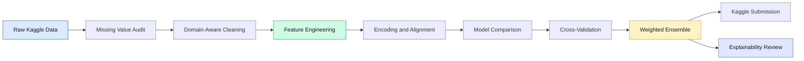
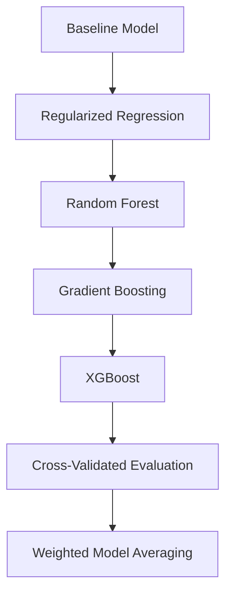
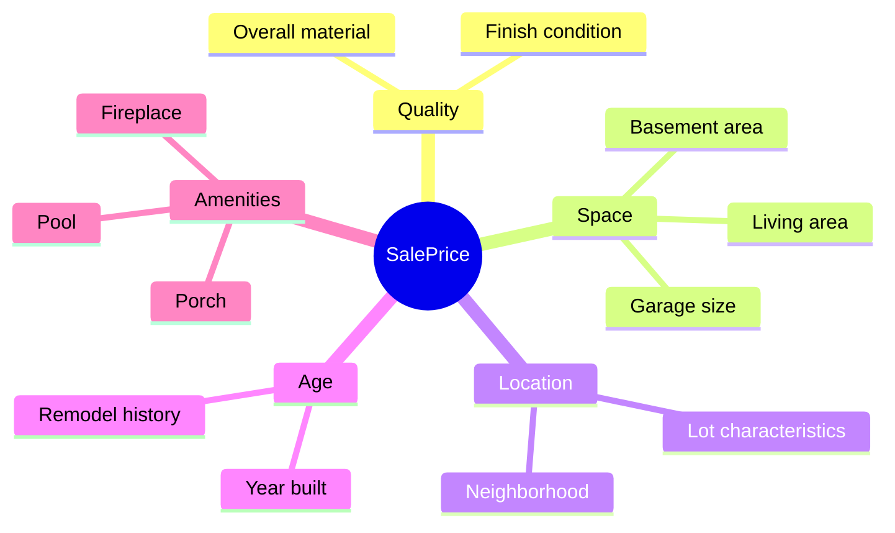

# Real Estate Price Prediction System

<div align="center">


[](#installation)
[](#modeling-approach)
[](#dataset)
[](#portfolio-positioning)


</div>

## Overview

A portfolio-ready machine learning case study for predicting residential property prices using structured real estate data, feature engineering, cross-validation, ensemble modeling, and explainability-focused analysis.

This project is based on the Kaggle **House Prices: Advanced Regression Techniques** competition, but it is packaged as an engineering case study rather than a simple notebook submission.

## Why This Project Exists

Real estate pricing is a practical business problem. Buyers, sellers, agents, and platforms all need a reliable way to estimate property value from available property attributes such as living area, quality, basement size, garage details, neighborhood, and renovation history.

The goal of this project is to build a regression pipeline that can:

| Capability | What It Adds |
| --- | --- |
| Data cleaning | Handles messy tabular housing records and missing values |
| Feature engineering | Converts raw property attributes into stronger pricing signals |
| Model comparison | Benchmarks multiple regression algorithms |
| Cross-validation | Reduces overfitting and improves trust in model performance |
| Ensembling | Combines model strengths for more stable predictions |
| Explainability | Connects predictions back to real property characteristics |

## Portfolio Positioning

Instead of presenting this as **"I solved House Prices"**, the project is positioned as:

> **Real Estate Price Prediction System with Feature Engineering and Explainability**

That framing makes the project more useful for recruiters and clients because it highlights engineering thinking, data reasoning, model evaluation, and business interpretation.

## Project Workflow



## Project Architecture

```text
real-estate-price-prediction-system/
|
|-- README.md
|-- requirements.txt
|-- .gitignore
|-- LICENSE
|
|-- notebooks/
|   `-- real_estate_price_prediction_case_study.ipynb
|
|-- data/
|   |-- raw/
|   |   `-- README.md
|   |-- processed/
|   |   `-- README.md
|   `-- submissions/
|       `-- README.md
|
|-- src/
|   |-- __init__.py
|   |-- data/
|   |   |-- __init__.py
|   |   `-- README.md
|   |-- features/
|   |   |-- __init__.py
|   |   `-- README.md
|   |-- models/
|   |   |-- __init__.py
|   |   `-- README.md
|   `-- visualization/
|       |-- __init__.py
|       `-- README.md
|
|-- docs/
|   |-- case_study.md
|   |-- modeling_strategy.md
|   |-- feature_engineering.md
|   |-- explainability.md
|   `-- production_notes.md
|
|-- reports/
|   `-- figures/
|       `-- README.md
|
|-- configs/
|   `-- README.md
|
`-- tests/
    `-- README.md
```

## Main Notebook

The full case study notebook is here:

```text
notebooks/real_estate_price_prediction_case_study.ipynb
```

The notebook contains the complete implementation and explanation flow:

| Stage | Focus |
| --- | --- |
| 1 | Problem framing |
| 2 | Data loading |
| 3 | Missing value audit |
| 4 | Target distribution analysis |
| 5 | Log transformation |
| 6 | Outlier handling |
| 7 | Feature engineering |
| 8 | Ordinal encoding |
| 9 | One-hot encoding |
| 10 | Train/test alignment |
| 11 | Model comparison |
| 12 | Cross-validation |
| 13 | Ensemble prediction |
| 14 | Kaggle submission file generation |
| 15 | Portfolio-level project reflection |

## Dataset

This project uses the Kaggle dataset:

**House Prices: Advanced Regression Techniques**

Due to Kaggle licensing and storage practices, the dataset is not included in this repository.

Download the dataset from Kaggle and place the files here:

```text
data/raw/train.csv
data/raw/test.csv
```

The original notebook uses a local `dataset\train.csv` and `dataset\test.csv` path. To run it exactly as written, either:

- create a local `dataset/` folder beside the notebook, or
- update the notebook paths manually after cloning the repo.

The notebook code is intentionally preserved as-is for portfolio transparency.

## Installation

Create and activate a virtual environment:

```bash
python -m venv .venv
```

Windows PowerShell:

```powershell
.venv\Scripts\Activate.ps1
```

macOS/Linux:

```bash
source .venv/bin/activate
```

Install dependencies:

```bash
pip install -r requirements.txt
```

Start Jupyter:

```bash
jupyter notebook
```

Then open:

```text
notebooks/real_estate_price_prediction_case_study.ipynb
```

## Modeling Approach



The project uses a practical tabular regression workflow:

- baseline linear regression
- regularized models
- random forest
- gradient boosting
- XGBoost
- stronger cross-validation setup
- final weighted model averaging

The target variable `SalePrice` is transformed using `log1p` to reduce skewness and stabilize model training. Final predictions are converted back using `expm1`.

## Feature Engineering Highlights

| Engineered Signal | Why It Matters |
| --- | --- |
| Total property area | Captures combined usable space |
| Total bathroom count | Converts multiple bath columns into one intuitive metric |
| Porch area | Represents outdoor living appeal |
| House age | Models depreciation and lifecycle effects |
| Remodel age | Captures modernization impact |
| Garage presence | Encodes a major buyer preference |
| Basement presence | Adds structural and usable-space context |
| Fireplace presence | Captures premium amenity value |
| Pool presence | Flags luxury or niche property features |
| Quality-adjusted area | Combines size and quality into a stronger pricing signal |

## Explainability Angle

The project does not treat the model as a black box only. It explains how price is influenced by property characteristics such as:

- overall quality
- living area
- basement size
- garage size
- neighborhood
- age and remodeling history
- premium property features



This makes the project easier to discuss in interviews and more relevant for real business use cases.

## What Makes This Portfolio-Ready

| Signal | Evidence |
| --- | --- |
| Structured project organization | Clear folders for notebooks, data, docs, source, reports, configs, and tests |
| Data cleaning decisions | Missing values are handled with domain context |
| Domain-aware feature engineering | New features reflect real housing-market intuition |
| Train/test consistency | Preprocessing aligns training and test data |
| Evaluation discipline | Models are compared with cross-validation |
| Ensemble thinking | Final prediction uses weighted model averaging |
| Explainability mindset | Results are interpreted through property characteristics |
| Production awareness | Future path includes API, tracking, validation, and deployment |

## Future Improvements

- convert notebook logic into reusable Python modules
- add MLflow experiment tracking
- add SHAP visualizations
- build a FastAPI prediction endpoint
- deploy a Streamlit demo
- create CI checks for data schema validation
- add automated feature tests
- add model registry and versioning

## Recruiter Summary

This project demonstrates the ability to take a raw Kaggle dataset and turn it into a professional machine learning case study with a clear business problem, structured analysis, feature engineering, model evaluation, and explainability.

The strongest signal is not simply the Kaggle score. The strongest signal is the engineering process behind the score.

<div align="center">


</div>
